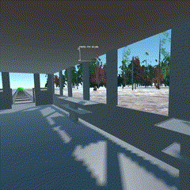

# Unity | C# | Portfolio

### WaterDrop
###### Unity3D | Hyper Casual

- Project Tasks
  - Build project architecture
  - Json save system
  - SO level system
  - Navigation
  - Game optimization
  - Implement SDK
  
  
### WildWest
###### Unity3D | VR | Multiplayer | RPG

- Project Tasks
  - Make Weapon VR interactive
  - Make Inventory System
  - Build AI Navigation (A* Pathfinding)
  - Create SO State Machine
  - IK Animation
  - Voice Chat
  - Photon prefab intantiation
  - Photon serialization
  - Implementation SDK
  - Game Optimization
  
### PuzzleLore
###### Unity2D | Hyper Casual | RPG | CardGame

- Project Tasks
  - Build Project Architecture
  - Create Json Database (NewtonSoft.Json)
  - Create Stats System
  - Upgrade Functionality
  - UI Adaptation
